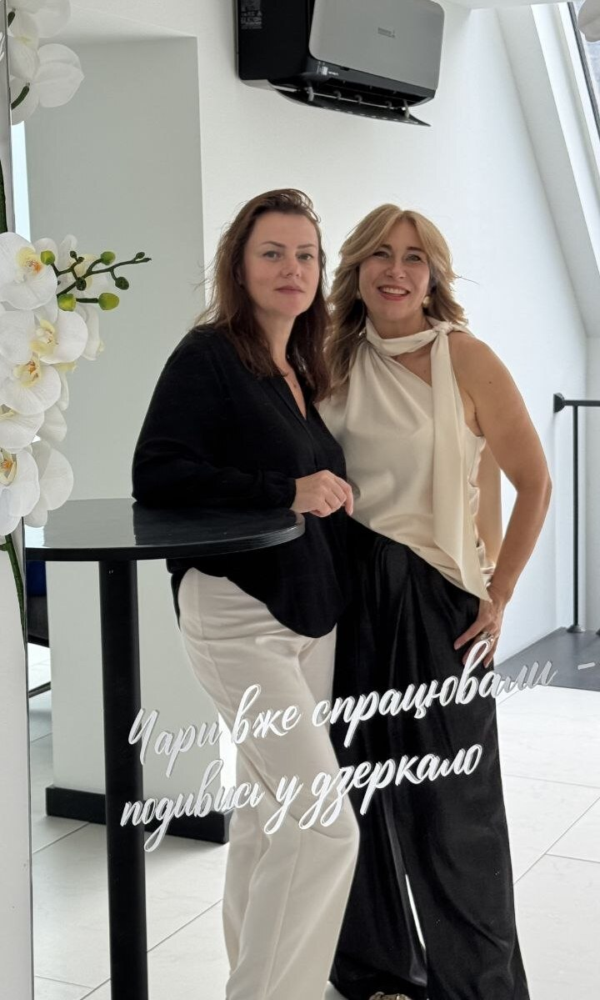
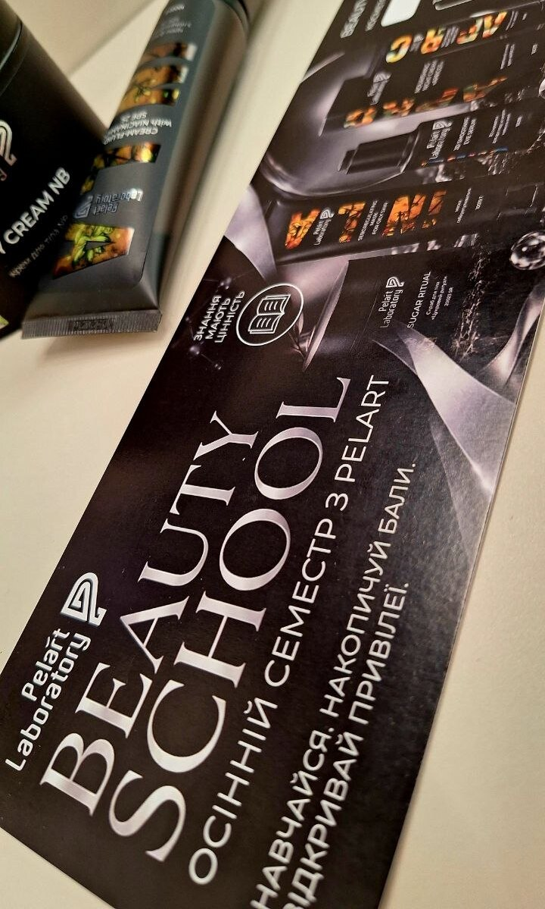
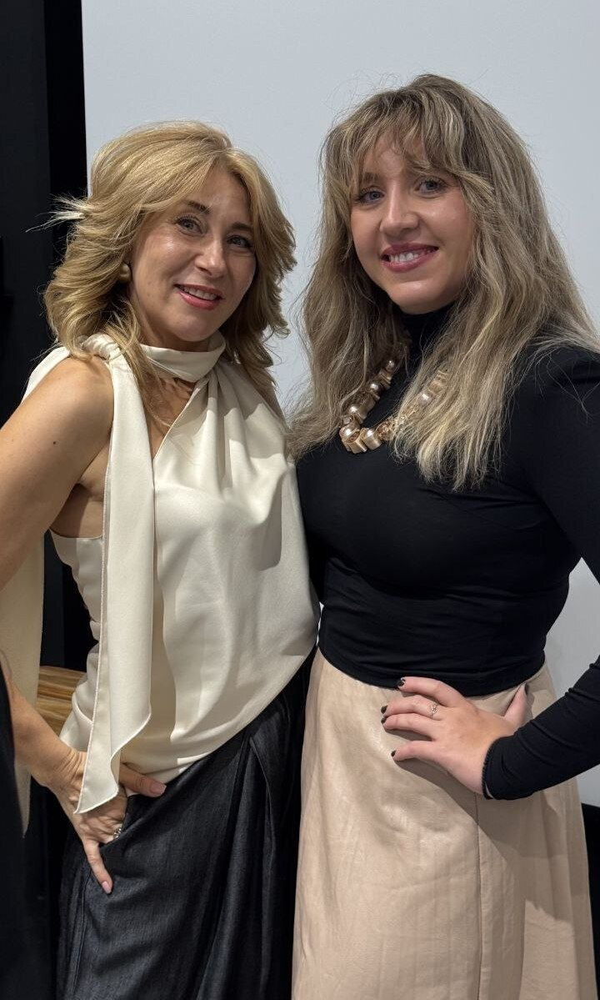
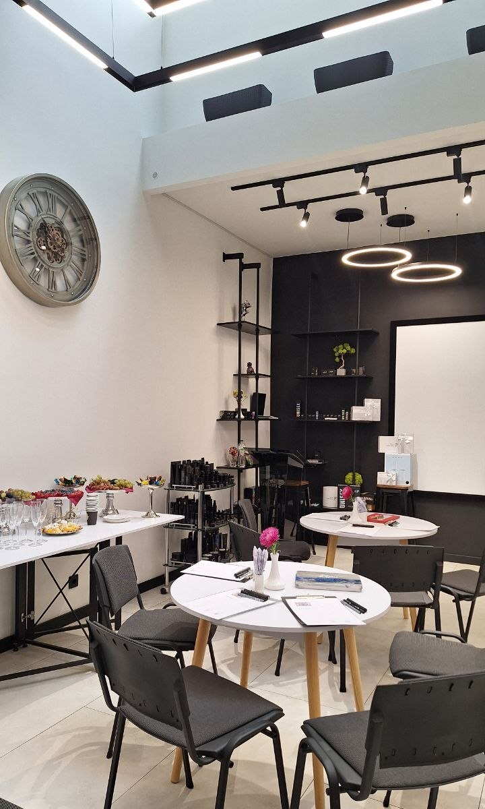

У межах триденного навчального семінару для фахівців естетичної медицини українсько-ізраїльської компанії **Pelart Laboratory** відбувся майстер-клас **«Beauty Inside: мистецтво починати з себе»**.

Темою зустрічі стала **нейрографіка як метод розкриття внутрішньої краси, ресурсу та потенціалу**.

Цього разу робота була спрямована на людей, професія яких безпосередньо пов'язана з красою інших.

Але Beauty Inside починається з іншого питання: **що відбувається з людиною, яка щодня працює з іншими, коли увага повертається до неї самої?**

Майстер-клас став простором, де професійне навчання на певний час поступилося місцем роботі із власним станом, внутрішнім ресурсом і тим, що зазвичай залишається за межами професійної ролі.

Нейрографіка тут була не просто творчою практикою, а способом зупинитися, переключити увагу із зовнішнього на внутрішнє та дослідити власний стан через образ, лінію і процес створення.

**Краса, з якою ми працюємо назовні, теж має внутрішню точку відліку.**

Іноді варто почати саме з неї.
