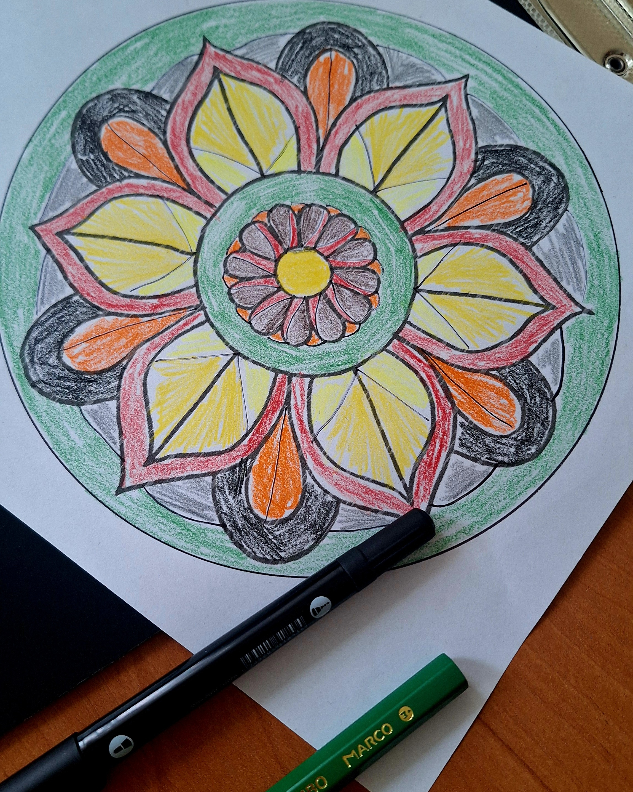
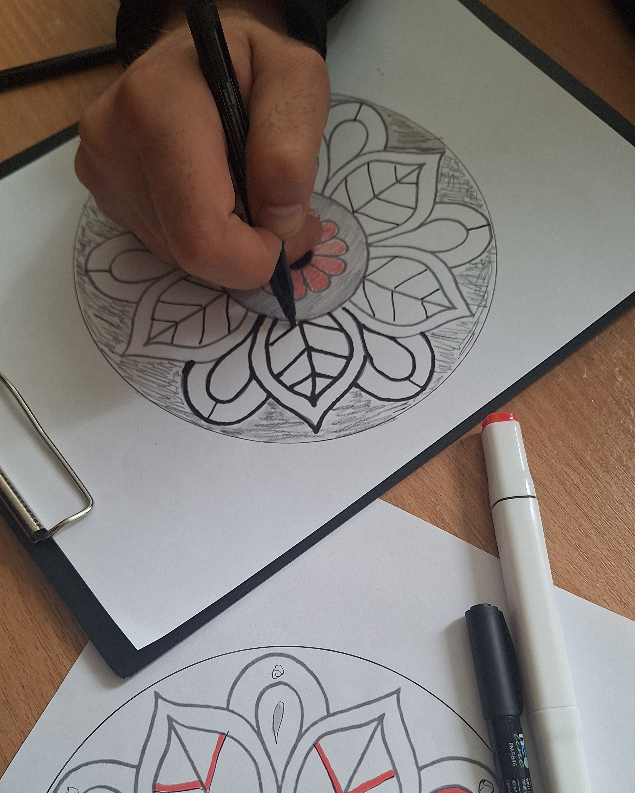
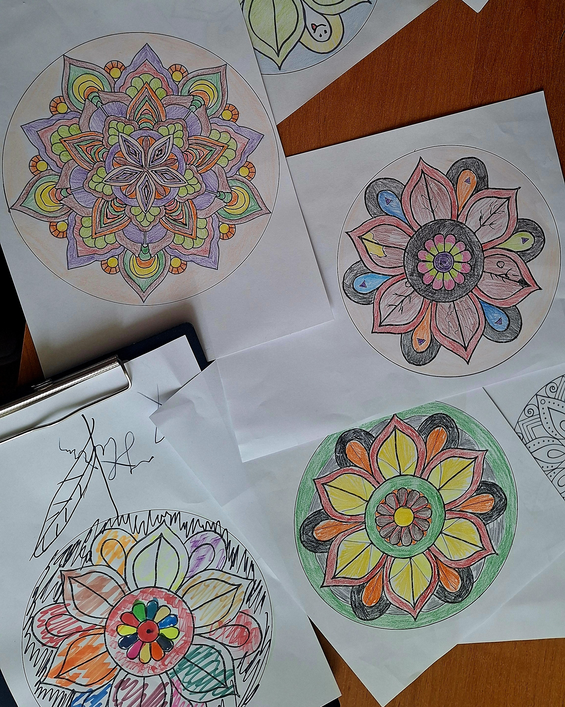

Сьогодні на Кирилівській, 103 відбулося нове арт-терапевтичне заняття з ветеранами.

Цього разу прийшли **вісім учасників**, серед них двоє людей, які пройшли полон.

Для добровільної групи вісім людей це багато. І для нас це важливий знак: люди приходять самі, залишаються в роботі й повертаються до неї.

Сьогодні працювали через **мандалу**.

В основі був готовий шаблон, але далі кожен працював із ним по-своєму: продовжував лінії, додавав власні елементи, обирав кольори, змінював композицію.

Завданням було не створити «правильний» або красивий малюнок.

Важливішим був сам процес: зосередитися на тому, що відбувається всередині, і дати цьому місце в роботі. У тому числі переживанням, про які не завжди хочеться говорити з іншими спеціалістами або взагалі переводити їх у слова.

Мандала в такій роботі стає способом зібрати внутрішній стан у певну форму: побачити його, доповнити, змінити, знайти власний порядок у кольорах, лініях і деталях.

Мета цієї практики проста: **гармонізувати внутрішній стан і допомогти йому повернутися до більшої рівноваги**.

Роботи вийшли різними.

Як і стани людей, які їх створювали.Тут починається текст.

