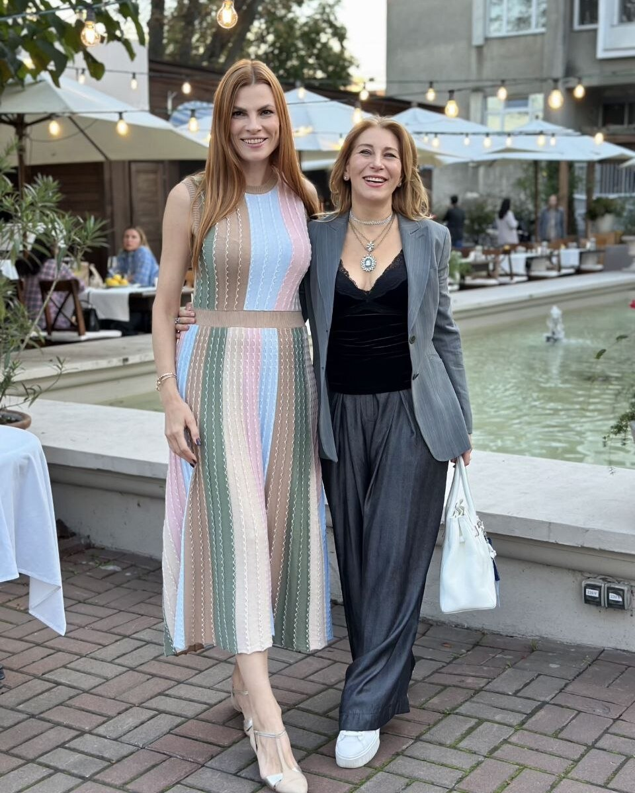
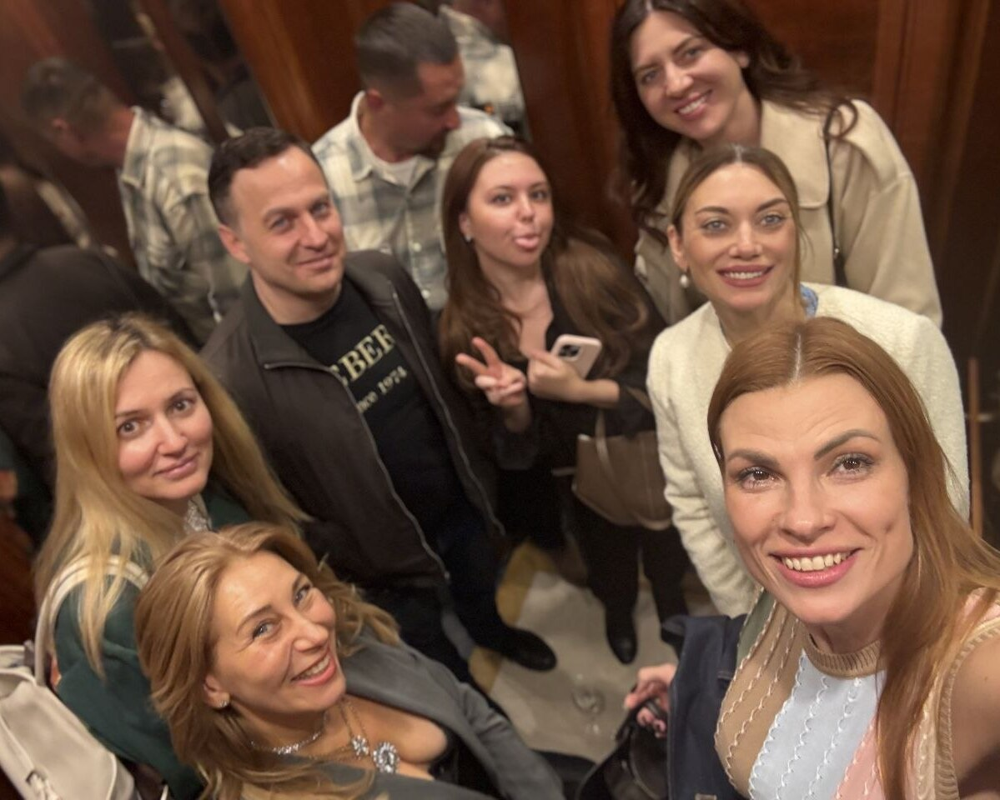

Святкова зустріч з засновницею Української Валькірії, громадською діячкою  та волонтекою Дариною Требух та урочисте нагородження спікерів першого випуску Школи цифрової грамотності

Серед спікерів були: Юлія Каліновська (екс радниця Міністра культури та стратегічних комунікацій), Олена Чуранова (фактчекерка StopFake, журналістка та викладач), Юлія Ткаченко (адвокат, засновниця юридичної компанії Magnum), Роман Леонович (ветеран, шромадський діяч), Марина Китіна (експерт з електромобілів), Олексій Мацука (журналіст, екс ген. дир Укрінформ).

