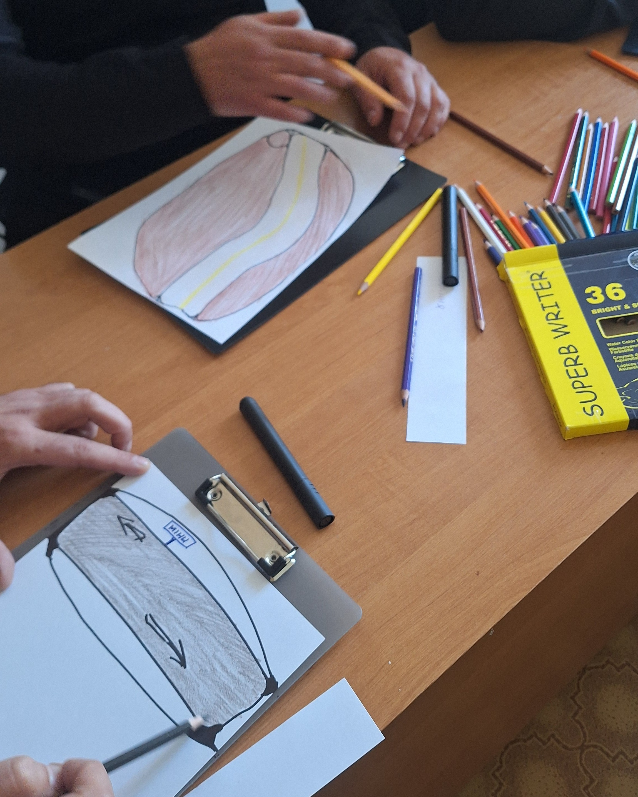
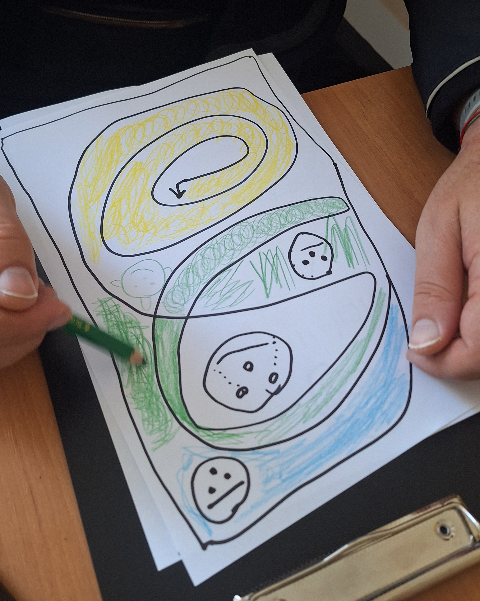
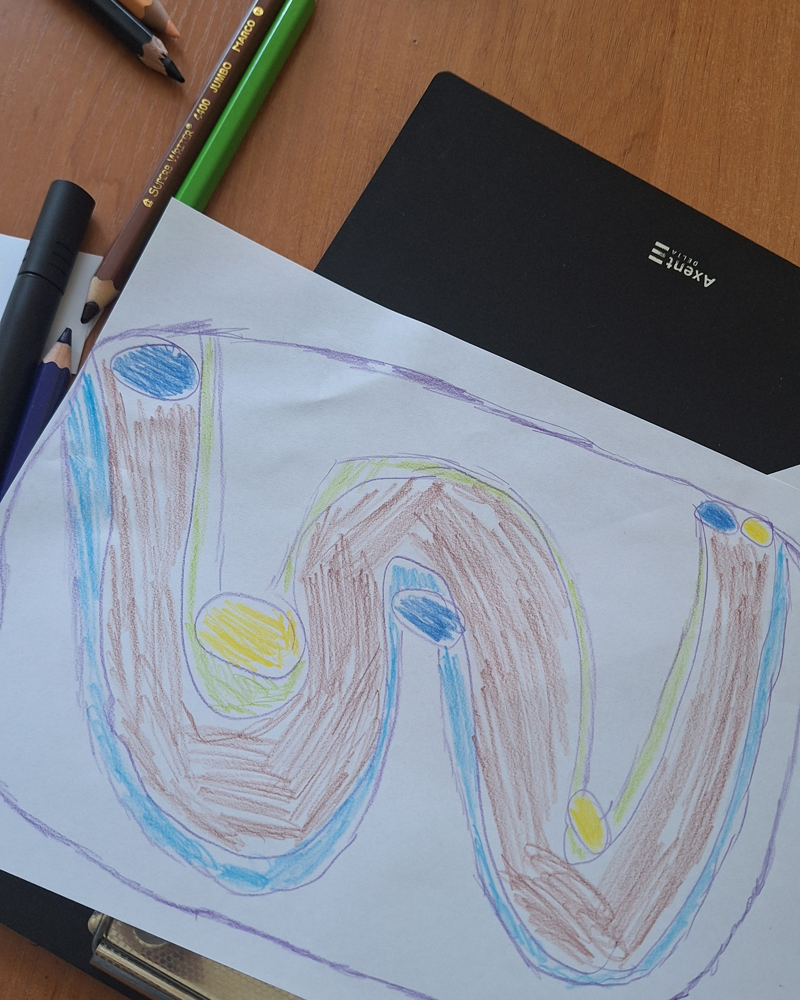
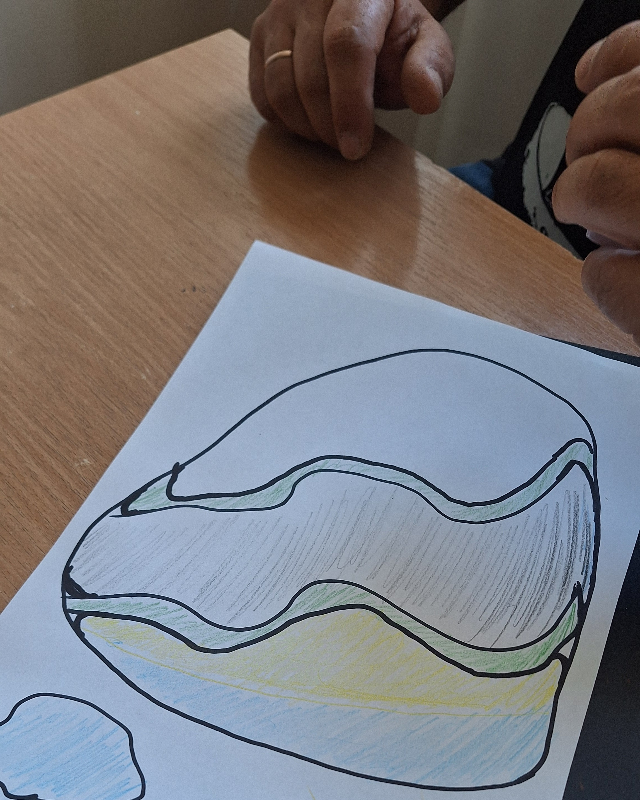

на цій зустрічі досліджували свій шлях через ріку сумнівів з книги "Місто навшпиньках"<!-- "Місто навшпиньках": [текст посилання](/library/) -->. Знаходили свій "парпорець", який допомагає зробити перший крок і закріпити досягнене. Кожен мавював свій шлях. Хтось-до чогось важливого. Хтось - від чогось. 

