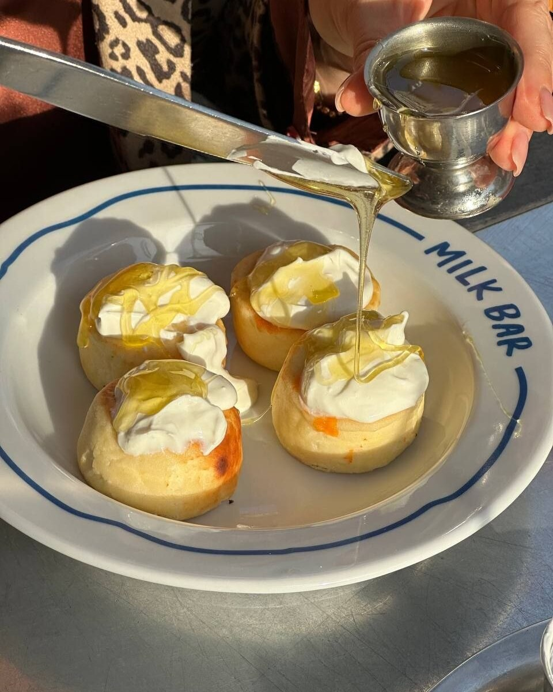

Куди зараз спрямована ваша увага?

На те, що тривожить?
На те, чого боїтеся?
На те, що не виходить і що потрібно терміново вирішити?

Це все є в нашій реальності. І ми не можемо просто перестати це бачити.

Але можемо додати до свого поля уваги інше.

Людей, які дають нам сили.
Зустрічі, після яких хочеться жити й діяти.
Сонце, яке раптом визирнуло з-за хмар.
Розмову, яка повернула віру в себе.
Маленькі перемоги.
Моменти радості.

Я все більше переконуюсь: увага — це теж наш ресурс.

Те, на чому ми затримуємо свій погляд, отримує більше місця всередині нас.

Тому я свідомо збираю такі моменти.
Фіксую їх. Запам’ятовую. Дякую за них.

Не для того, щоб заперечувати складність життя.

А для того, щоб серед усього, що виснажує, не втрачати те, що підтримує.

Бо нам потрібні сили не тільки для того, щоб витримувати.
Нам потрібні сили, щоб жити, діяти, створювати і рухатися вперед.

Іноді почати можна з дуже простого — перевести свою увагу туди, де є життя. 🌞

