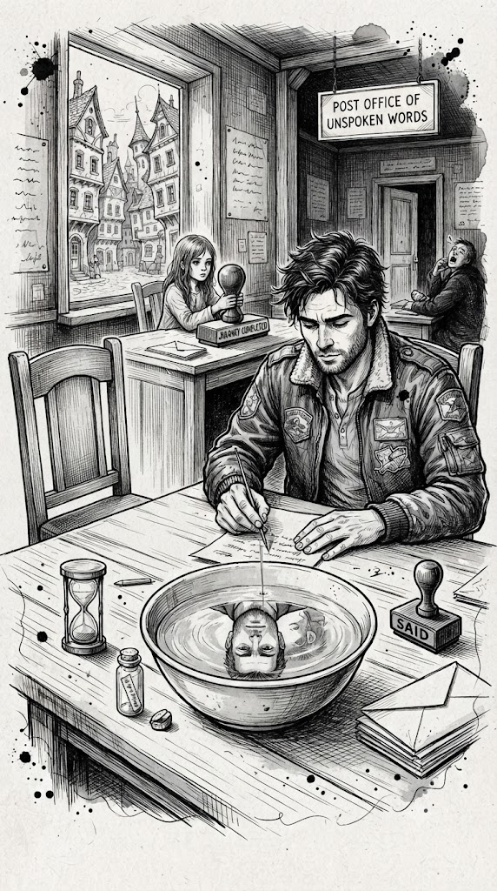

### Точка на карті 8.

## Поштове Відділення Несказаних Слів

Ми прийшли туди під вечір - у ту тонку годину, коли місто

наче ще не спить, але вже репетирує сон. Будівля пошти

стояла навшпиньках, як і все тут, але трималася особливо

акуратно, ніби боялася шелестом потурбувати чужі

таємниці. На фронтоні висіла табличка, написана

каліграфією, якою зазвичай підписують вироки та весільні

запрошення:

«ПОШТОВЕ ВІДДІЛЕННЯ НЕСКАЗАНИХ СЛІВ. Листи, які

застрягли між “треба було” і “вже пізно”».

Всередині пахло пилом, чаєм і тим дерев'яним

терпінням, яким пахнуть столи, що багато років слухають

людей. У залі стояли довгі столи з лампами - тими самими,

зеленими, з бібліотек, де книжки шепочуться між собою

ночами. На кожному столі стояв пісочний годинник, лежала

пачка конвертів і гумовий штамп. На штампі я розгледів

слово «ДОСКАЗАНО».

— О, новенькі, — мовив сонний поштмейстер. Він мав

такий вигляд, ніби його можна було скласти навпіл як аркуш

паперу і сховати в шухляду до ранку. На бейджі було

написано: «Тут ми нічого не виправляємо. Ми досказуємо».

— Правила знаєте?

— Ні, — чесно відповів я.

— Тоді коротко. У нас три вікна.

Вікно No1 — «Напиши до кінця»: без правок, без розумних

вставок. Десять–п'ятнадцять хвилин. Пісок у годиннику не

обдуриш.

Вікно No2 — «Відправка»: якщо адресат живий, лист іде.

Якщо адресат — минуле, лист прямує в Кімнату Погашення.

Вікно No3 — «Ритуал закриття»: для тих, кому треба не

«сказати», а «закінчити».

— А якщо я не хочу нікому писати? — запитав Хом'як із

Пам'яттю, визираючи з-за мого плеча.

— Тоді пишеш собі, — позіхнув поштмейстер. — Сам собі

— найскладніший адресат.

Ми сіли за стіл. Лампа тихо і плавно сама ввімкнулась.

Пісочний годинник подивився на мене з виглядом істоти,

якій давно набридло чекати, поки ти дозрієш, і

перевернувся теж сам. Без дозволу чи прохання.

Я взяв один із конвертів. Він був цупким. Не папір —

характер. На ньому заздалегідь стояв маленький напис: «Не

пересилати на завтра».

— Пиши, — сказав поштмейстер, відступаючи в тінь. —

Тільки не торгуйся з текстом. Йому й так було дорого

мовчати.

Я почав. Рука спочатку пручалася: хотіла виправляти,

підбирати слова, ніби від цього залежала вся планета. Але

пісок падав, і літери самі знаходили одна одну, як люди,

яким пора нарешті зустрітися. Я писав тому, кому так і не

сказав, де помилився, де злякався, де було «прости» і «не

можу». Спочатку було сухо. Потім — раптом мокро. Якась

фраза поцілила просто під ребра. Я не перечитував. Пісок

— тик-тик. Серце — тук-тук. Зрештою я поставив крапку не з

граматики, а з видиху.

— Час, — м'яко мовив поштмейстер. — Конверт закрити?

— Так.

Коли клей торкнувся паперу, я почув усередині тихий

хлопок, наче десь зачинили вікно перед дощем. Ми підійшли

до Вікна No2. Там сиділа дівчина з очима кольору степу

після зливи. На її столі лежав величезний штемпель:

«ШЛЯХ ЗАВЕРШЕНО».

— Адреса? — запитала вона.

Я назвав ім'я. Жива людина. Далека, але жива.

— Відправимо, — кивнула вона. — А тепер із другим

примірником листа, який створюється автоматично — у

Кімнату Погашення. Про всяк випадок.

— Навіщо? — здивувався я.

— Іноді лист доходить уже пізніше за життя, — сказала

дівчина. — Тоді нам важливо, щоб він був доставлений і

завершений тебе.

Вона повела нас коридором. Він був тихим, як вибачення.

На дверях висіла табличка Кімната Погашення. Всередині

стояв круглий стіл і велика керамічна чаша. На дні була

вода, у якій віддзеркалювалися наші обличчя. Поруч лежала

маленька різьблена ложечка.

— Ритуал простий, — сказала дівчина. — Якщо цей лист

про кінець, ти даєш йому закінчитися. Ми не знищуємо лист,

щоб «спалити мости». Ми даємо воді загасити вогонь, який

давно горить без користі. Як марку погашають на пошті

штемпелем, бо вона вже виконала свою функцію.

Вона протягнула мені тонку голку.

— Проколеш конверт — вода увійде всередину й усе

розчинить. Або якщо хочеш щось зберегти - розкрий,

прочитай вголос і виділи одну фразу, яку хочеш забрати з

собою. Потім лист у воду. Ця фраза залишиться на воді і ти

зможеш її забрати з собою. У будь-якому разі — ставиться

штамп «ДОСКАЗАНО», і край.

— А якщо я не готовий? — запитав Хом'як, тримаючись

за свій самознищувальний контейнер, у якому пісок ішов

своєю чергою.

— Тоді відкладеш. Тут нічого не нав'язують, — сказала

вона. — Але у води терпіння краще за будь-якого психолога.

Я обрав друге. Розкрив конверт, прочитав тихо. Голос

спочатку дрижав, потім знайшов тембр. Знайшов одну

фразу — не красиву, не ідеальну, але справжню. Поклав

лист у чашу. Вода піднялася назустріч й прийняла його так,

як приймають дітей після довгої дороги, — без запитань і з

повним прийняттям. Папір заспівав шепотом літери

попливли, замерехтіли і розтанули в прозорій глибині.

Залишилась тільки дорога мені фраза, яку я ложечкою

переніс в маленьку колбу з пробкою. Так, у них і таке було.

Дівчина поставила штамп «ДОСКАЗАНО» на квитанцію.

Штамп був теплим, наче його довго тримали в долонях.

— А якщо адресат — минуле? — запитав Хом'як. — Або

я сам, десятирічної давнини?

— Тоді все йде за коротким колом, — сказала дівчина. —

Нікуди не відправляємо. Тільки погашення. На такі листи

все одно ніхто не відповідає. Але саме їх часто бояться

відправляти.

Ми вийшли назад до зали. Поштмейстер кивав комусь уві

сні.

— У тебе розгладилося обличчя, — помітив Хом'як. — І

на зріст став ніби на сантиметр вищим.

— Це все через світло від ламп, — спробував

пожартувати я. Але знав: не в лампах діло.

Ми стояли біля дверей. Там висіло маленьке

оголошення: «Якщо раптом здається, що ви сказали не все

— це нормально. Слова — як потяги. Вони завжди ходять

пізніше, ніж хочеться, і раніше, ніж страшно».

— Пішли? — запитав Хом'як.

— Пішли, — сказав я і сунув колбу з однією фразою в

кишеню. Вона майже нічого не важила, але світ наче

нарешті вмостився на місце.

## Техпідтримка того, що відбувається // Точка на

карті 8.

Поштове Відділення Несказаних Слів — місце, де можна

сказати те, що так і не було сказано. Сказати собі, іншим,

минулому. Або досказати і відпустити.

Що з цим робити в реальності:

●

Пиши лист 10–15 хвилин. Не редагуй.

●

Якщо це живому адресату віддай або

надішли. Як хочеш, листом, електронною

поштою чи як фотографію. Доскажи те, що так

і не наважувався сказати, щоб завершити

відоме тільки тобі. Або..не віддавай, якщо ти

ще не готовий. Головне що слова вийшли

назовні.

●

Якщо це про минуле, застосуй ритуал

погашення: прочитай вголос і постав фінальну

крапку через довіру воді, яка прийме і

розчинить все що треба було досказати. Для

цього випадку бажано писати водорозчинним

маркером на тонкій серветці.

*Цитати для конвертів і колб:*

«Написати щоб досказати — це поставити крапку не з граматики, а з видиху».

