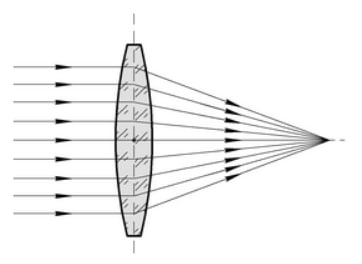
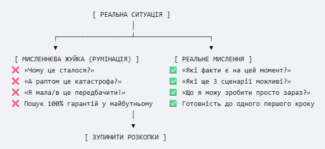

# ПЛЯМА І СЕРІАЛ
Ви помічаєте на руці пляму. Невелику. Червонувату. Раніше її не було.

Ви дивитеся на неї при світлі лампи. Потім підходите до вікна й розглядаєте при денному світлі. Потім ідете у своїх справах, але за п’ять хвилин дивитеся знову. Пляма не змінилася. Вона не стала більшою, не засвербіла й не закровила.

Але мозок уже запустив конвеєр.

За десять хвилин пошуку в інтернеті ви знаєте назви трьох рідкісних шкірних патологій. За двадцять порівнюєте фотографії на медичних сайтах. За тридцять згадуєте, від чого помер троюрідний дід по материнській лінії. До вечора ви подумки пройшли обстеження, попрощалися з близькими й розподілили спадщину.
Пляма при цьому залишилася такою самою. Змінилося лише одне: у неї з’явилася історія.
Тривога майже ніколи не починається там, де є реальна небезпека. Якщо на вас мчить вантажівка, ви не розмірковуєте про природу невизначеності, ви стрибаєте вбік. Тривога розквітає там, де закінчуються факти й починається добудовування.
Зазвичай заведено вважати, що її головний об’єкт - страх перед поганим результатом. Це напівправда. Її головний об’єкт - невизначеність.
При цьому наш розум цілком нормально витримує те, що не знає цін на хліб через п’ять років або кольору машини, яка зараз поверне з-за рогу. Ми спокійно живемо всередині гігантського масиву невідомого. Проблема виникає лише тоді, коли конкретний шматок невідомого стає для мозку недостатньо поясненим, недостатньо осяжним або недостатньо контрольованим.
І ось тоді запускається титанічна й абсолютно марна робота.
Одна ситуація генерує лавину думок. Людина починає ганятися за кожною з них: «А раптом це?», «А чому він так сказав?», «А що, як завтра?..»
Це ловля відлуння. І в цього процесу є чітка геометрія. Тривога дивиться або назад, вимагаючи від минулого остаточного пояснення, або вперед, вимагаючи від майбутнього стовідсоткової гарантії.
Ні того, ні іншого вона не отримає. Але витратить на ці пошуки все ваше теперішнє.
# АРХЕОЛОГІЯ І ВИРОК
Є люди, які роками носять із собою одне й те саме запитання: «Чому це сталося?»
Іноді йдеться про розлучення чи банкрутство. Іноді про одну невдалу розмову десятирічної давнини. Людина давно змінила квартиру, роботу, оточення і все одно лежить о 03:15 ночі й думає: «А чому я тоді не відповів інакше?»
Для мозку ця історія не закінчена. Не тому, що він сподівається переписати минуле, а тому, що досі не отримав пояснення, яке вважав би вичерпним.
Уявіть людину, в якої в супермаркеті сталася панічна атака. Раптом закалатало серце, перехопило подих, земля попливла. Напад минув, але мозок негайно склеїв зручну формулу: Супермаркет → Небезпека. Людина починає уникати магазинів.
Але давайте відмотаємо плівку. Що відбувалося останні три місяці? У неї валився проєкт. Вони з дружиною взяли великий кредит на квартиру. Вона три тижні спала по чотири години. Напередодні випила літр міцної кави натщесерце. А за секунду до нападу в голові промайнула думка: «Я більше не витримаю такого ритму».
До чого тут супермаркет? Ні до чого. Але мозок любить прості перемикачі.
Подія - це не кісточка доміно, яку штовхнула одна попередня кісточка. Подія - це фокус лінзи. До неї під різними кутами сходилися десятки променів: фізіологія, втома, минулий досвід, необережне слово, випадковий збіг. В одній точці вони перетнулися - і спалахнуло.

Але тривожний розум уперто шукає «головну причину». Або, що ще гірше, «винного».
Зрадив чоловік. Перша реакція: «Він сволота». Друга, руйнівна: «Що я зробила не так? Мабуть, я приділяла йому замало уваги». І жінка починає перебирати минуле, намагаючись знайти розвилку, де можна було натиснути кнопку «скасувати».
Це пастка. Ви берете людину з минулого - з її тодішнім ресурсом, втомою, гормональним фоном і незнанням - і судите її з позиції себе сьогоднішнього, який уже знає фінал. Ви кажете: «Я мала зрозуміти».
Ні, не мала. Тоді ви цього не знали.
Минуле неможливо розібрати до останньої молекули. Але його можна пояснити достатньо.
Достатньо - це коли замість містичного «зі мною щось не так» або примітивного «він винен» з’являється сукупність факторів: «У тій точці склалися ось ці п’ять обставин. Я ухвалював рішення, маючи ту інформацію і той ресурс, які були в мене під рукою».
Після цього розкопки треба припинити. Не тому, що ви дізналися все. А тому, що подальший аналіз уже не змінює факту.
# ТРИ СХОДИНКИ ДО КАТАСТРОФИ
Якщо минуле вимагає відповіді на запитання «Чому?», то майбутнє допитує: «Що саме станеться?»
Вам приходить коротке повідомлення від керівника: «Зайди до мене завтра о 10:00». Текст займає один рядок. Ваш внутрішній монолог за наступні дві години заповнить невеликий зошит.
Простежте за механікою:
«Мене можуть звільнити». (Можливість.)
«Найімовірніше, мене звільнять». (Імовірність.)
«Мене звільняють, чим я платитиму іпотеку?!» (Факт.)
Мозок пролітає ці три сходинки за мить. Ви ще сидите на робочому місці, вам поки що нараховують зарплату, але емоційно ви вже складаєте речі в картонну коробку й переживаєте ганьбу.
Ви платите емоційну ціну за подію, якої не існує.
Тривожна людина обожнює називати себе «реалістом». «Я просто враховую найгірший варіант», - каже вона. Але реалізм - це не здатність вигадати найжахливіший сценарій. Реалізм - це здатність утримувати в голові весь діапазон можливостей.
Між «усі все виправлять і мене похвалять» та «мене виженуть зі скандалом» лежить величезна територія реального життя:
· Керівник хоче перерозподілити завдання.
· У звіті знайшли помилку, яку треба виправити.
· Він хоче обговорити графік відпусток.
· Він узагалі забув, навіщо кликав, і перенесе зустріч.
Але тривога вирізає середину. Вона бінарна: або порятунок, або катастрофа.
Майбутнє не складається з двох кнопок. Коли ви намагаєтеся витягнути з нього єдиний правильний сценарій, ви займаєтеся ворожінням. Майбутньому треба повернути не «позитивне мислення» - це той самий обман, тільки з іншим знаком, - а його природний обсяг.
Запитайте себе не «А раптом усе рухне?», а «Які ще три варіанти існують просто зараз?»
А потім зробіть крок, який мозок зазвичай саботує: «Якщо реалізується найгірший варіант, яким буде мій перший зрозумілий крок?»
Не дев’ятнадцять кроків до кінця життя, а один. Якщо звільняють - я прошу рекомендації й оновлюю резюме. Якщо діагноз підтверджується - іду до другого спеціаліста, щоб звірити схему лікування.
Щойно в катастрофи з’являється маршрут, вона перестає бути туманом і стає просто паршивою, але цілком вирішуваною задачею.
# МИСЛЕННЯ ПРОТИ РУМІНАЦІЇ
Ви просиділи за обговоренням своєї проблеми дві години. Втомилися. Голова гуде. Здається, ви виконали величезну інтелектуальну роботу.
Насправді ви не думали. Ви жували.
Є принципова різниця між розв’язанням проблеми й румінацією, тобто мисленнєвою жуйкою.
· Розв’язання проблеми змінює або ваше розуміння ситуації, або ваш план дій.
· Румінація ганяє одну й ту саму інформацію по двадцятому колу, намагаючись витягнути з неї те, чого там немає, - абсолютну гарантію.
Ви надіслали людині повідомлення. Вона прочитала його о 09:00. Зараз 18:00, відповіді немає. Ви відкриваєте листування чотирнадцять разів. Перевіряєте, чи була вона онлайн. Перечитуєте своє повідомлення, шукаючи там приховані образи.
Чи з’явилася у вас нова інформація після десятого відкриття чату? Ні. Чи змінився ваш план? Ні. Ви просто обслуговуєте імпульс.
Маркер простий: якщо наступна думка не дає нового факту й не змінює наступного кроку - це не мислення. Це тривога, яка прикидається роботою розуму.
Підготовка до майбутнього завжди має кінцеву точку. Якщо ви збираєтеся в поїздку, подивитися прогноз погоди й покласти парасолю - це підготовка. Перевіряти прогноз кожні п’ятнадцять хвилин у надії, що ймовірність дощу зміниться з 30% на 0%, - це тривога.
Підготовка захищає. Румінація виснажує.
Зрілість полягає в тому, щоб упіймати себе на місці злочину й сказати: «Так, стоп. Нових даних немає. Процес завершено».
# ІЛЮЗІЯ КОНТРОЛЮ ТА ЙОГО МЕЖІ
Чому ми так судомно чіпляємося за перевірки, перепитування й уявне моделювання?
Тому що всередині сидить дитяча ілюзія: якщо я напружено думатиму про небезпеку, вона не станеться. Ми плутаємо хвилювання з контролем. Нам здається, що якщо ми розслабимося хоча б на хвилину, світ негайно скористається нашою безпечністю й завдасть удару.
Тривога - це спроба керувати тим, що вам не належить.
Розділіть будь-яку ситуацію на три жорсткі сектори:
Зона прямого впливу. Чи витягнув я вилку з розетки? Чи подав резюме? Чи прийшов на прийом до лікаря?
Зона впливу на інших. Я можу просити, аргументувати, ставити умови, але рішення ухвалює інша людина.
Зона повної невизначеності. Чи піде дощ, чи впаде маркетплейс, як поводитиметься економіка, кого вибере роботодавець із п’яти кандидатів.
Тривожний мозок намагається поширити перший сектор на третій. Він хоче контролювати чужі думки, майбутні діагнози й випадкові збіги.
Жінка вимогливо допитує чоловіка: «Ти точно мене не кинеш?» Він відповідає: «Не кину». На пів години їй стає легше. Потім мозок шепоче: «А раптом він збрехав, щоб я відчепилася?» - і потрібен новий допит.
Жодна відповідь не дасть гарантії на десять років уперед. Ви не можете отримати сертифікат безпеки на людські стосунки. Ви або погоджуєтеся на допустимий рівень ризику, який неминучий у близькості, або перетворюєте життя на поліцейський нагляд, який гарантовано знищить будь-яку близькість.
Контролюйте те, що лежить на вашому робочому столі. Решті дозвольте просто відбуватися.
# ТІЛЕСНИЙ РЕФЛЕКС І ДЕСЯТЬ ХВИЛИН
Бувають моменти, коли вся ця філософія марна. Ви ще нічого не встигли подумати, а тіло вже ввімкнуло аварійний режим. Серце гупає так, що віддає в зуби, у грудях усе зібралося в щільний вузол, долоні мокрі, дихання рване.
Мозок миттєво підтягує думку: «Мені погано, отже, я помираю / божеволію / зараз станеться щось жахливе».
І тут стається головна помилка: спроба негайно це припинити.
Людина починає судомно й глибоко дихати, вимірювати пульс, пити воду, шукати заспокійливе. Тіло отримує чіткий сигнал: відбувається катастрофа, треба рятуватися! Тривога посилюється.
Запам’ятайте: відчуття - це факт. Його інтерпретація - це гіпотеза.
· Серце б’ється часто - факт.
· «У мене інфаркт» - гіпотеза.
· Долоні спітніли - факт.
· «Я ганьблюся перед людьми» - гіпотеза.
Якщо реальної фізичної загрози просто зараз немає - на вас, наприклад, не падає шафа, - припиніть лагодити свій стан.
Дайте хвилі пройти.
Хвиля тривоги має біохімічний цикл. Викинутий адреналін розщеплюється організмом у середньому за три-тринадцять хвилин, якщо не підкидати в топку нові мисленнєві дрова.
Скажіть собі: «Окей. Мені зараз страшно. Серце калатає. Я даю цьому стану десять хвилин. Я нічого не робитиму з ним ці десять хвилин. Не бігатиму, не перевірятиму пульс і не рятуватимуся. Я просто посиджу з цим».
Тривога змушує нас діяти негайно. Відмовте їй у негайності.
Коли ви дозволяєте хвилі дійти до піку й спасти без ваших судомних рятувальних дій, мозок отримує абсолютно новий досвід: «Мені було хріново, але я не помер, і світ не рухнув». Цей досвід у тисячу разів цінніший за будь-які позитивні афірмації.
# ХОРОБРІСТЬ БЕЗ ГЕРОЇЗМУ
Нам із дитинства продають фальшивку: нібито сильна людина - це та, яка нічого не боїться.
Це дурня. Людина, яка нічого не боїться, - або пацієнт із пошкодженим мигдалеподібним тілом, або ідіот.
Мета роботи з тривогою - не стати безстрашним роботом. Мета - позбавити тривогу права вето.
Раніше ланцюжок виглядав так:
Мені страшно → Отже, там небезпека → Я не піду / не зроблю / скасую.
Тепер він має виглядати так:
Мені страшно → Я перевіряю, чи є реальні факти загрози → Фактів немає, є лише мої прогнози → Мені все ще страшно, але я роблю крок.
Ви можете йти на розмову з тремтячим голосом. Можете сідати в літак із вологими долонями. Можете чекати результатів аналізів і водночас варити каву й розмовляти з дитиною.
Тривога не зобов’язана зникнути, щоб ви почали жити. Вона може сидіти в сусідньому кріслі й бурмотіти свої апокаліптичні прогнози. Нехай бурмоче. Ви не зобов’язані віддавати їй кермо.
Гарантій не буде. Минуле ніколи не стане абсолютно прозорим. Майбутнє ніколи не стане на 100% передбачуваним.
Але вам і не потрібна абсолютна гарантія. Вам потрібне лише одне: розуміння свого наступного ясного кроку.
А з рештою ви розберетеся тоді, коли воно настане. Не раніше. Не пізніше.
# ВИСОКА ЦІНА «НЕБАЙДУЖОСТІ»
У тривоги є геніальний маскувальний костюм. Коли їй стає соромно зізнатися, що вона - просто боягузтво або нервовий збій, вона вдягає форму «високої відповідальності» чи «турботи».
Ви відкриваєте телефон об одинадцятій вечора. Дитина-підліток затримується на сорок хвилин.
Звичайна людина телефонує, чує: «Так, я вже їду, я в автобусі», - і йде пити чай.
Тривожна людина за ці сорок хвилин встигає:
Відкрити карту й подивитися, де «зазвичай» ходять маргінали.
Обдзвонити двох її друзів, намагаючись зобразити «ненав’язливу цікавість».
Продумати сценарій звернення до поліції.
Поставити собі діагноз: «Я жахлива мати, якщо не проконтролювала її маршрут».
Коли дитина заходить у двері, на неї обрушується не любов, а накопичений афект. Заплакане або перекошене від злості обличчя, крики, звинувачення: «Ти про мене подумав?! Ти взагалі розумієш, що я пережила?!»
Подивіться на цей механізм. Це не турбота про дитину. Це вимога до дитини негайно обслужити материнську невизначеність.
Турбота каже: «Я хочу, щоб ти був у безпеці».
Тривога каже: «Я не можу витримати незнання, де ти перебуваєш, тому швидко поверни мені мій спокій».
Те саме відбувається в бізнесі під соусом «перфекціонізму».
Керівник перечитує лист клієнту дев’ять разів. Змінює формулювання, перевіряє коми, переписує другий абзац. Йому здається, що він домагається «ідеальної якості».
Ні. Він просто намагається за допомогою тексту отримати гарантію, що клієнт не відмовить, не подумає про нього погано й не піде до конкурентів.
Але текст не може дати такої гарантії. Лист може бути бездоганним, а в клієнта просто зміниться бюджет.
Результат: пропущені дедлайни, вигорілі співробітники, витрачені три години на дворядковий email і тотальна ілюзія «я тут один працюю на совість».
Якщо ви ловите себе на тому, що переперевіряєте, контролюєте або вимагаєте від інших звітів «із любові / відповідальності», зупиніться й поставте собі одне пряме запитання:
«Чию реальну проблему я зараз вирішую: їхню чи власну нездатність витримати паузу?»
Якщо їхню - дійте. Якщо свою - приберіть руки від телефона.
# РЯТУВАЛЬНІ КРУГИ, ЯКІ ТОПЛЯТЬ
Коли тривога стає постійним фоном, людина починає обставляти своє життя «захисними ритуалами». Вона може навіть не помічати, як її світ стискається до розмірів сірникової коробки.
Ось класичний наболілий набір:
· Носити із собою в сумці три види заспокійливих, пляшку води й тонометр - на випадок, якщо «накриє».
· Сідати в кінотеатрі чи на концерті лише на крайнє місце біля виходу - щоб «якщо що, швидко вибігти».
· Не їздити мостами / метро / трасами без «надійного» супутника.
· Перепитувати близьких: «Ти точно на мене не образився?» або «Я нормально виглядаю?» перед кожним виходом.
Психіка грає з вами в дуже злу гру.
Щоразу, коли ви сідаєте скраю й притуплено переживаєте фільм, мозок робить висновок: «Бачиш! Ми вижили тільки тому, що сиділи біля виходу!»
Щоразу, коли ви робите ковток води при легкому прискоренні пульсу, мозок фіксує: «Вода нас урятувала. Без води ми б померли».
Ці милиці не захищають вас. Вони переконливо доводять вашій нервовій системі, що ви нездатні впоратися з реальністю самостійно.
Ви перетворюєтеся на заручника власних страховок. Сумка без пачки таблеток починає викликати паніку сама по собі, навіть якщо тиск у нормі.
Вихід тут виглядає дико для тривожного розуму, але він єдиний реальний:
Ламайте ритуали.
· Вийдіть із дому без «рятувальної» аптечки.
· Купіть квиток у центр ряду.
· Відчуваєте імпульс запитати «Ти не сердишся?» - прикусіть язика й промовчіть.
Ваше завдання - дати нервовій системі прямий, неспростовний фізичний факт: «Я опинився всередині невизначеності без милиць - і нічого не вибухнуло. Адреналін піднявся, побув на піку й пішов. Я живий».
Поки ви тягаєте із собою рятувальний круг, ви ніколи не дізнаєтеся, що вмієте плавати.
# ЗАМКНЕНЕ КОЛО ТІЛЕСНОГО НАГЛЯДУ
Окрема категорія пекла - це люди, які перетворили власне тіло на об’єкт цілодобової інспекції.
Ранок починається не з кави, а з внутрішнього сканування:
· «Так, як там голова? Не важка?»
· «А дихання? Вдих повний?»
· «Щось у лівому боці кольнуло... Раніше кололо? Здається, ні».
Будь-яке людське тіло - це галаслива біохімічна фабрика. У ньому постійно щось бурчить, коле, натягується, прискорюється й уповільнюється. Змінилася погода, не так повернув шию, з’їв щось гостре, просто втомився - тіло реагує безперервно.
Але тривожна людина ставиться до тіла як до панелі приладів космічного корабля, де загоряння будь-якої лампочки означає негайний вибух реактора.
Вмикається механізм посилення через увагу:
Ви спрямовуєте фокус на ліве плече.
Починаєте вдивлятися: «А чи немає там якогось відчуття?»
За дві хвилини плече справді починає здаватися затерплим або ниючим, бо мозок посилює чутливість зони, на яку спрямований фокус.
Ви думаєте: «Я так і знав! Там щось є!»
Викидається адреналін - судини звужуються - плече чи груди стискає ще сильніше.
Висновок: «Мені гірше».
Вітаємо. Ви щойно власною увагою згенерували тілесний симптом із нічого.
Якщо ви пройшли базові медичні обстеження й лікарі не знайшли гострої патології - введіть режим медичного карантину.
Перестаньте вимірювати тиск по п’ять разів на день. Викиньте пульсоксиметр. Забороніть собі гуглити слова «симптоми», «біль у...» та «форум хворих...».
Якщо симптом справді небезпечний - ви його не пропустите, він проявить себе яскраво й недвозначно. Але 95% того, за чим ви стежите, - це просто шум організму, який працює, а ви роздули його до масштабів катастрофи власним пильним поглядом.
Тіло не треба контролювати. Йому треба просто заважати менше, ніж ви звикли.
# МИСТЕЦТВО ЗУПИНКИ
КОРОТКИЙ ПРОТОКОЛ
Давайте зберемо все, про що ми говорили, у жорстку робочу послідовність, яку можна застосувати за тридцять секунд, коли мозок починає розкручувати черговий сценарій.
Коли накочує: «А раптом...» - ви робите чотири послідовні рухи розуму.
Крок 1. Відтиснути історію до факту
· Було: «Він не відповідає, мабуть, ми розходимося, я залишуся сам».
· Стало: «Людина не відповіла на повідомлення, надіслане о 14:00».
Крок 2. Перевірити межі впливу
· Запитання: «Чи можу я просто зараз прямо вплинути на появу відповіді, не перетворюючись на психопата?»
· Відповідь: «Ні. Людина на тому кінці зв’язку мені не належить».
Крок 3. Нарізати варіанти
· Не: «Усе скінчено» або «Все буде ідеально».
· А: «Він зайнятий / забув / втратив зв’язок / злиться / обмірковує відповідь. Я дізнаюся про це лише тоді, коли він відповість».
Крок 4. Поставити часовий стоп-лос
Це головне. У будь-якого очікування має бути «стоп-лос» - зрозумілий рубіж, до якого ви нічого не робите.
· «Я не перевіряю телефон до 20:00. Якщо до 20:00 відповіді немає - надішлю коротке уточнення. До 20:00 тему закрито, я займаюся своїм життям».
Усе. Без глибокої психотерапії, без пошуку причин у ранньому дитинстві, без викликання духів.
Ви просто ставите греблю на шляху хаотичного потоку.

# СВОБОДА БЕЗ ГАРАНТІЙ
Ми звикли думати, що щастя - це коли все зрозуміло, безпечно й гарантовано.
Це ілюзія. Повна визначеність буває лише в одному місці - на кладовищі. Там нічого не змінюється, немає ризиків, ніхто не запізнюється, не зраджує й не звільняє.
Живе життя - це за визначенням територія суцільного ризику.
Ви можете вийти з дому й закохатися. Можете втратити гроші. Можете створити проєкт, який провалиться, або проєкт, який змінить ваше життя. Можете захворіти, а можете дожити до дев’яноста років у відносному здоров’ї.
Ніхто не дасть вам письмових гарантій. Жоден автор, жоден психолог, жоден лікар.
Але хороша новина в тому, що гарантії вам і не потрібні.
Вам достатньо знаючого, дорослого, трохи іронічного погляду на самого себе й простої внутрішньої готовності:
· Минуле було складним, але воно закінчилося, і я зрозумів із нього достатньо.
· Майбутнє розгалужене, але я бачу в ньому достатньо варіантів і знаю свій перший крок для кожного.
· А просто зараз я сиджу тут, п’ю свою каву, роблю свою роботу й не віддаю жодної хвилини сьогоднішнього дня фантомам, яких іще немає.
На цьому все. Можете закрити книгу й піти займатися справами.
А якщо мозок знову прошепоче: «А раптом?..» - просто усміхніться йому й дайте відповідь:
«Можливо. Я розберуся з цим тоді. А зараз я зайнятий».

