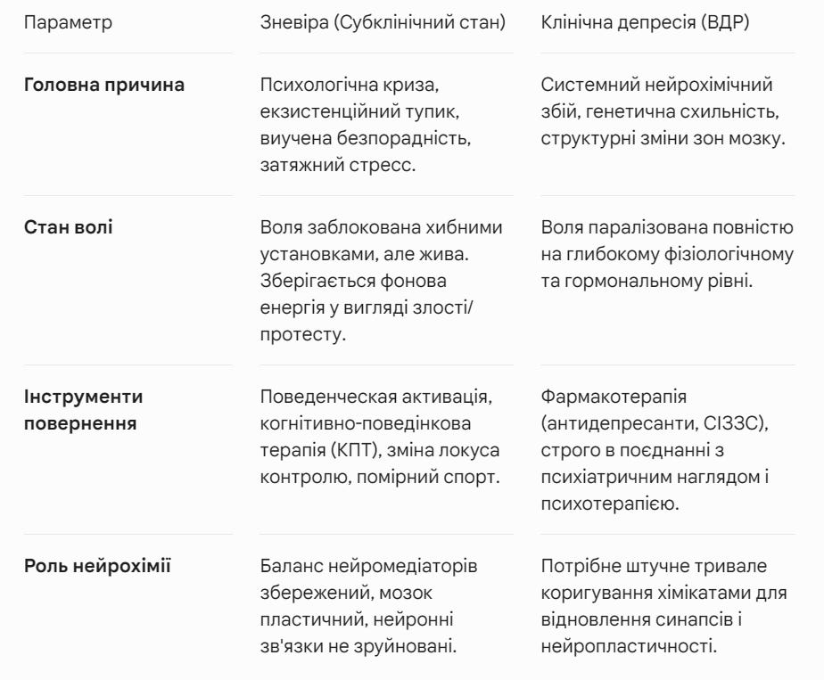

Нещодавно у мене відбулася досить цікава розмова про зневіру. Мені сказали, що зневіра - це типу... нічого серйозного. Ну, "приунила" людина, що тут страшного.

Але поступово наша розмова перейшла й до теми зневіри як біблійного гріха. «Нічого серйозного» не стали б включати в такий текст, та ще й у список смертних гріхів. Уже тоді розуміли небезпеку цього стану.

Говорили довго, сперечалися, і я пообіцяв написати в окремій статті свій погляд на небезпеку цього стану, його взаємозв’язок із депресією та варіанти виходу з нього. Щоб потім дати почитати учасникам розмови. Та й іншим людям це може виявитися корисним. Адже я на власному досвіді знайомий практично з усім спектром таких станів і розладів, і щоб вибратися, був змушений глибоко вивчати питання.

У сучасному лексиконі слово «депресія» вже стало ментальним паразитом. Ми називаємо ним поганий настрій через дощову погоду, втому після важкого робочого тижня, екзистенційний сум або тимчасову втрату орієнтирів. Однак між звичайною (навіть затяжною) зневірою та клінічною депресією лежить прірва.

Помилково приймати одне за інше. У першому випадку людина перебуває в глибокій психологічній кризі, але все ще має ресурс для вольового зусилля, перемикання фокуса та переосмислення життя. У другому — вона зіткнулася з важкою системною поломкою біології, де потрібна серйозна медична та фармакологічна допомога.

Спробую розібрати ключові відмінності між цими станами, спираючись на психологію, нейробіологію та філософію, щоб зрозуміти, де закінчується терапія й починається психіатрія.

Зневіра як провісник: точка входу в хворобу
Зневіра - це не просто швидкоплинна «грустинка». Це стан пасивного, в’язкого невдоволення життям, при якому опускаються руки, а звичні стимули перестають радувати. Сама по собі ця емоція від початку є адаптивною: психіка вмикає режим жорсткої економії енергії після сильного або затяжного стресу. Мозок просто намагається захистити себе від перевантаження.

Однак небезпека зневіри в тому, що вона здатна пускати коріння. Якщо цей стан затягується на місяці й роки, він перетворюється із захисного механізму на деструктивний процес, який поступово підточує ресурси організму.

>Наукове підтвердження: У доказовій медицині та психіатрії аналогом затяжної зневіри часто виступає субклінічна (підпорогова) депресія. Людина з таким станом ще не відповідає всім критеріям клінічного діагнозу, але вже функціонально обмежена. Тривалі дослідження, що публікуються в таких авторитетних виданнях, як The American Journal of Psychiatry, впевнено підтверджують, що наявність підпорогових депресивних симптомів є найсильнішим провісником розвитку важкого Великого депресивного розладу (ВДР). За висновками цих досліджень, ризик клінічного колапсу зростає в кілька разів. Хронічна зневіра поступово виснажує здатність мозку адаптуватися до стресу. Тінь у вигляді зневіри, якщо її вчасно не розігнати, поступово готує ґрунт для падіння в глуху біологічну безодню депресії.

Механізм зневіри: безсилля, звуження світу та жива злість
Коли людина стикається із затяжною кризою - чи то постійна неможливість вирватися зі злиднів, чи виснажлива фонова екзистенційна загроза типу війни, крах життєвих ілюзій або тривала хвороба - у неї виникає природна реакція: гнів і протест. Психіка вимагає змінити зовнішні обставини. Але якщо змінити їх об’єктивно неможливо, цей гнів не знаходить виходу назовні.

Світ людини у зневірі швидко звужується. Вона втрачає інтерес до широкого кола спілкування, інформації та захоплень, зациклюючись на глобальній несправедливості того, що відбувається або стосовно світу в цілому, або конкретно до свого «Я». Виникает феномен застрягання. Не маючи можливості атакувати зовнішнє джерело стресу, людина неусвідомлено розвертає цю бурхливу енергію проти самої себе. Гнів перетворюється на аутоагресію. Людина починає нескінченно прокручувати в голові думки про власне безсилля, звинувачувати себе, знецінювати свої минулі досягнення й глибше занурюватися в апатію.

Але тут прихована ключова, принципова відмінність зневіри від клінічної депресії: у зневірі все ще жива злість.

Людина у зневірі може злитися на себе («я ганчірка»), ображатися на несправедливість долі, внутрішньо протестувати. Ця злість, нехай навіть руйнівна й спрямована всередину - свідчення того, що підсвідома воля до боротьби ще не знищена. Внутрішнє багаття ще горить, просто воно заблоковане хибними установками. У той же час при класичній важкій депресії агресія (як і будь-які інші емоції) практично повністю вигоряє. Там залишаються ледь тліючі вуглинки. У депресивної людини немає ні сил, ні бажання проявляти злість; там настає емоційне оніміння. Якщо в рідкісних випадках важкого ВДР і проявляється агресія, то вона має характер панічного захисту повністю виснаженого мозку, а не прихованого ресурсу для боротьби.

>Психологічний механізм: Цей феномен детально описано в концепції «виученої безпорадності» Мартіна Селігмана. Коли мозок на основі тривалого негативного досвіду переконується, що його дії ні на що не впливають, він тимчасово припиняє спроби щось зробити задля економії ресурсів. З точки зору класичного психоаналізу (починаючи зі знаменитої праці Зігмунда Фрейда «Печаль і меланхолія»), зневіра - це проміжна фаза, коли енергія протесту блокується і починає повільно підточувати Его зсередини, звужуючи сприйняття до розмірів свого болю, але все ще зберігаючи внутрішнє ядро особистості.

Духовний аспект: історична помилка поділу
У християнській богословській традиції зневіру (acedia) не дарма включено до списку головних гріхів. Але сучасній людині важливо правильно розуміти контекст стародавніх текстів. Слово «гріх» у первісному біблійному значенні (грец. hamartia) перекладається как «промах», «помилка» або духовна хвороба, що шкодить самій людині, а не юридична вина перед караючим судом.

Богослови вважали зневіру вкрай небезпечною, тому що вона паралізує волю. Це втрата віри у власні сили, у добру природу світу та в саму можливість зцілення. У християнській літературі зневіру називають «всеїдною смертю для душі», оскільки вона позбавляє людину здатності творити, любити й сподіватися. Це капітуляція перед труднощами.

Однак тут криється колосальна історична трагедія. У часи, коли писалися ці тексти, людство ще нічого не знало про нейробіологію. Богослови фізично не могли розділити психологічну зневіру та важку хворобу — депресію, що виникає через внутрішні біологічні причини організму. Через цю понятійну склейку мільйони людей сьогодні роблять страшну помилку: стикаючись із клінічною депресією, вони вважають її «гріхом зневіри» або лінощами. Замість того щоб іти к психіатру за медикаментозною допомогою, вони намагаються «витягнути себе за комір», карають себе за слабкість, моляться через силу і тим самим остаточно знищують залишки нейрохімічних ресурсів мозку.

Заклик древніх «боротися зі зневірою волею» ефективний тільки тоді, калі біологічний фундамент мозку ще цілий. Застосовувати його до людини в клінічній депресії — це злочинно.

Депресія: коли ламається біологія
Якщо зі стану зневіри людину можна вивести психотерапією, переосмисленням, зміною умов або поведінковими практиками, то з клінічною депресією це не спрацює. На цьому етапі чиста психологія поступається місцем біології. Затяжна зневіра, що постійно наповнює організм гормонами стресу, рано чи пізно ламає фізіологічний тумблер.

Великий депресивний розлад (ВДР) - це не поганий настрій, а важке системне нейроендокринне захворювання. Про це у своїх лекціях і книгах постійно говорить дуже шанований мною Роберт Сапольскі, професор Стенфордського університету й один із головних світових експертів зі стресу. Сапольскі жорстко наполягає: депресія має настільки ж реальну біологічну та соматичну природу, як діабет або рак. Це не «криза характеру», це тотальний біологічний крах організму.

Дефіцит нейромедіаторів: У хворих критично порушується обмін і зворотне захоплення ключових нейромедіаторів — серотоніну, норадреналіну та дофаміну. Мозок фізично втрачає здатність проводити сигнали радості й задоволення. Рецептори заблоковані або атрофовані. Цей стан називається ангедонією.

Гормональний і структурний крах: При депресії ламається головний «пульт управління стресом» - система, що пов’язує мозок і надниркові залози. У нормі вона працює як простий автомат: зіткнулися зі стресом - виділився гормон кортизол, допоміг пережити проблему й вимкнувся. При депресії цей вимикач ламається. Організм починає беззупинно, гігантськими дозами виробляти кортизол (гормон стресу). Хронічно високий рівень кортизолу діє на мозок як агресор: він буквально зменшує в об’ємі клітини гіпокампу - зони, що відповідає за пам’ять, контекстуалізацію страхів і регуляцію емоцій.

Нейрозапалення: Сучасні дослідження показують, що мозок депресивної людини функціонує в режимі хронічного низькорівневого запалення та кисневого голодування.

Людина в депресії не «сумує» і не «капітулює» - її нервова система фізично руйнується. Вимагати від неї «просто взяти себе в руки» або «знайти позитив» - це абсолютно те ж саме, що вимагати від людини зі зламаною та роздробленою ногою встати й пробігти марафонський забіг силою навіювання.

Вихід із піке: вольова активація проти медицини
Різниця в природі цих двох станів диктує діаметрально протилежні стратегії повернення до нормального життя.

Із зневіри можна й необхідно виходити самостійно або з допомогою психолога, поки вона не переродилася в органічну патологію. Оскільки у зневірі ще зберігається вуглинка злості на себе або світ, цей гнів потрібно використовувати як паливо. Його необхідно розвернути зсередини, де він спалює особистість, назовні - на здійснення конкретних дій.

У доказовій когнітивно-поведінковій терапії цей метод називається поведінковою активацією. Щоб зламати виучену безпорадність за Селігманом, людині необхідно повернути залізобетонне переконання «мої дії впливають на результат».

Для цього глобальні цілі, що здаються непідйомними, дробляться на мікроскопічні, гарантовано виконувані завдання.

Помірна фізична активність (спорт), повернення базового режиму, виконання маленьких справ (помити посуд, навести лад на столі) та допомога іншим людям повертають мозку досвід успішної дії.

Кожна маленька перемога дає мікродозу дофаміну, поступово розширюючи звужений світ людини назад до нормальних масштабів.

При клінічній депресії воля знищена тілесно. Людина не може зробити маленький крок не тому, що вона лінива, а тому що в неї немає хімічної можливості для передачі нервового імпульсу. У цьому стані антидепресанти не «роблять людину дурнувато-щасливою». Вони виконують технічну роботу: знижують рівень нейрозапалення, захищають від кортизолового перевантаження й штучно відновлюють зруйнований хімічний фундамент. Фармакологія потрібна лише для того, щоб у депресивної людини з’явилися базові фізичні сили просто почистити вранці зуби, дійти до терапевта й повернути здатність сприймати слова психолога або терапевта.

Зневіра - це небезпечний, затяжний психологічний тупик, у якому агресія, заперта всередині через неможливість контролювати зовнішні обставини, звужує світ людини й починає повільно перемелювати її особистість.

Якщо залишити зневіру без уваги, заохочувати власне безсилля, піддаватися цьому заціпенінню й не намагатися розвернути внутрішній гнев у конструктивну зовнішню дію, запускається незворотний каскад біологічних реакцій. Хронічний стрес із часом перероджується в гормональний та нейрохімічний колапс. Психологія остаточно перетворюється на жорстку соматику - клінічну депресію.

Розуміння цієї межі буквально рятує життя. Воно допомагає вчасно жорстко взяти себе за комір у моменти затяжного хандри, використовуючи залишки злості для поведінкового ривка, і водночас вчить проявляти глибоке співчуття, дбайливість, коли близька людина щиро й важко хвора на депресію. І вчасно запропонувати допомогу психіатра.

